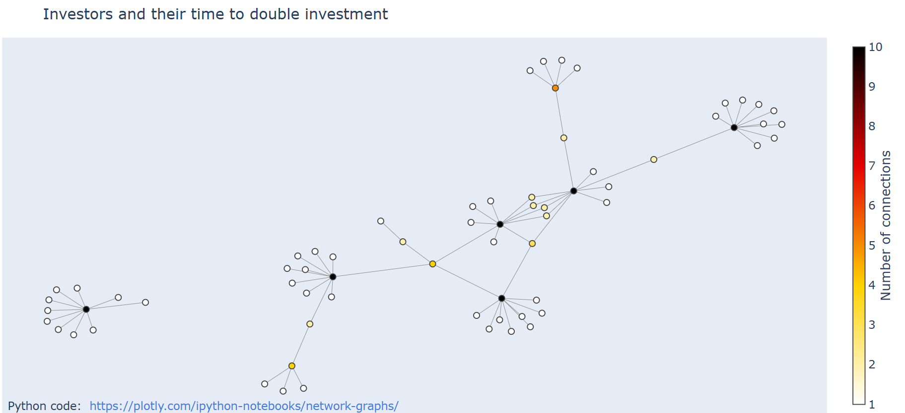
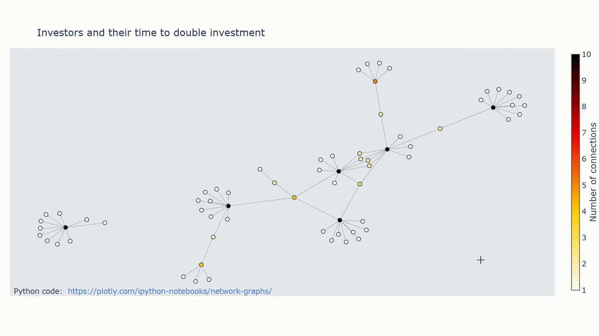
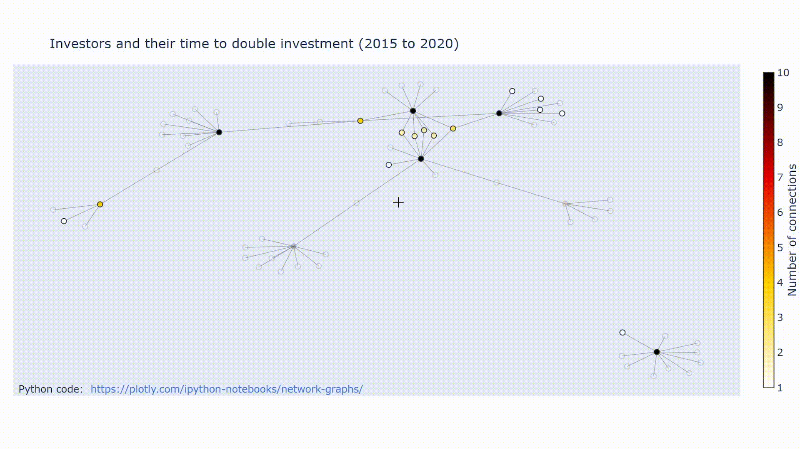
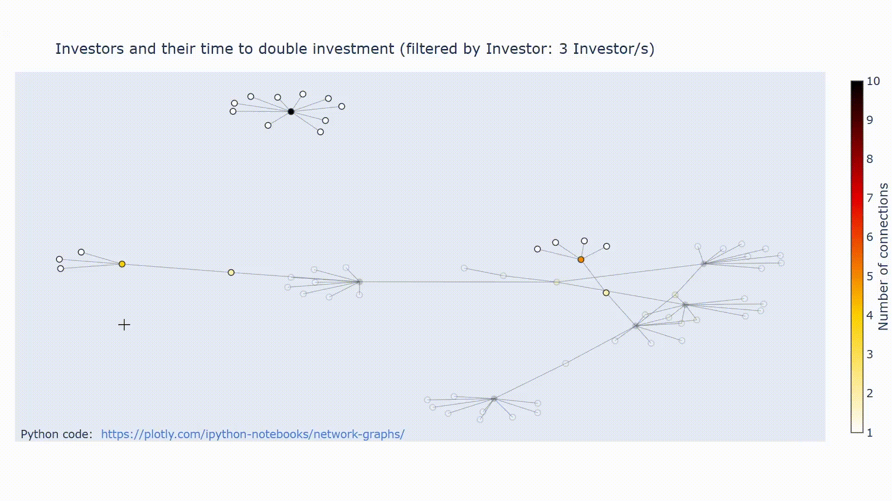
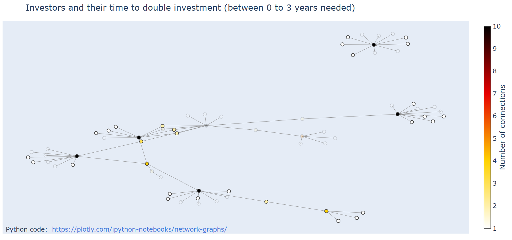

# PREÀMBUL

## Aclariment
Aquest programa fou un treball freelance per una companyia del sector tecnològic de Barcelona, per tal d'obtenir una eina de representació de dades en forma de graf no dirigit. Aquí hi ha el codi que vaig compartir amb la companyia, però anonimitzat tant en el fitxer de dades original, noms de variables i comentaris dels diferents fitxers .py que conté (per questions relacionades amb un NDA).

En l'adaptació que he fet s'ha buscat una forma de reaprofitar el treball que vaig fer de tal manera que es mantingui l'ànima original del projecte, en el seu aspecte tècnic; però que mostri unes dades diferents, igualment d'encaixables en l'estructura del programa que vaig fer.

## Teconologies utilitzades

Per fer aquest projecte s'ha fet servir `Python`, com a llenguatge de programació i diverses llibreries disponibles per a aquest llenguatge: [][][`plotly`](https://plotly.com/python/), per fer la representació gràfica del graf; [`Networkx`](https://networkx.org/), per tal de representar internament el graf com un conjunt de nodes i d'arestes i passar-los certes propietats. També s'ha fet servir `JSON` per tal de guardar les coordenades de cada node  per successives crides de la funció que crea el gràfic.

# DESCRIPCIÓ
  
## Finalitat del programa, explicació de variables en l'excel i en el gràfic

Podeu obrir l'excel `1. fitxerInversions_inicial.xlsx` per veure les dades introduides. S'ha escollit fer un sistema per visualitzar inversors i les companyies en les quals aquests inverteixen, tot mostrant en quin moment aquestes inversions es dupliquen en valor (tenen un ROI del 100%).
    
Per tal de fer aquesta representació s'ha introduit com a nodes en un graf tant diversos inversors de renom (columna `Investor`) com algunes companyies en les quals aquests inversors pressumiblement han invertit (columna `Investment`). Una aresta entre un inversor (`Investor`) i una inversió (`Investment`) implica que va haver una operació de compra d'accions per part de l'inversor en aquella companyia. Si us situeu damunt l'aresta que uneix ambdós, veureu més dades de la inversió que es va fer, concretament:
    
- **Buy Date**: La data de compra de l'acció per part de l'inversor.
- **Forecast [Investment x2]** o bé **[Investment x2]**: si surt la primera etiqueta ens indica la data en la qual en el futur s'estima que es dobli una inversió donada; si, pel contrari, surt el segon significa que la inversió ja es va duplicar en valor després de la seva compra i que, per tant, s'ha pogut obtenir de dades d'accions que ja són registrades en el passat (tot dependrà de si a la columna de l'excel `Forecast_Sell_Date` -que és d'on es volquen les dades de l'excel per a aquesta etiqueta de l'aresta- la data és posterior al moment en que vaig registrar les dades: 23/02/2023 o no (això queda recollit simplement a la columna `Is_Forecast`).

Noteu que tant les columnes `Buy_Date` com `Forecast_Sell_Date` mostren anys i que són derivades de dates més exactes (columnes `PRECISE_Buy_Date` i `PRECISE_Forecast_Sell_Date`) que hipotèticament contenen, de forma respectiva, els moments en que es varen comprar i que es podrien haver venut (o vendre en el futur) al doble del valor pel qual es van comprar. Aquestes dues columnes més precises en termes de moment temporal (no en correspondència amb la realitat!) s'utilitzen per computar la diferència en anys entre el moment de compra i el moment hipotètic de duplicació de la inversió, càlcul que es fa a la columna `Time_Difference` de l'excel. Aquesta columna es fa servir per calcular anys, mesos i dies que passen des de la `PRECISE_Buy_Date`fins a la `PRECISE_Forecast_Sell_Date` i mostrar-ho de forma precisa dins de cada aresta (fent servir la funció `converteixAny_a_AnyMesDia()`).
   
La generació del fitxer de dades `1. fitxerInversions_inicial.xlsx` s'ha obtingut de forma iterativa fent preguntes a [chatgpt (GPT3.5)](https://chat.openai.com/chat). No són dades reals, però es poden aproximar a la realitat, ja que ChatGPT intenta produir dades reals a partir de la base de coneixement disponible a internet fins a l'any 2021. Així doncs, preneu aquest dataset pel que és: una prova de concepte per mostrar coneixement de la llibreria NetworkX, plotly, pandas, etc. i també d'algorismia i coneixement del llenguatge Python, no com un fotografia exacta de la història de les inversions fetes per Elon Musk, Carl Icahn, David Einhorn, George Soros, John Paulston, etc.


## ON FER CANVIS EN LES DADES?

Si heu fet canvis a `1. fitxerInversions_inicial` heu d'executar `parseExcel.py`que produirà un segon excel amb les dades depurades (excel que no heu de tocar: `2. fitxerInversions_parsejatFinal.xlsx`). És d'aquest excel d'on es prenen les dades per a executar el programa principal que produeix els gràfics `__main__grafGuay.py`. Més endavant us explico com fer servir el teu propi dataset.

# EXECUTAR EL PROGRAMA

## Fer filtres

Un cop tingueu l'excel llest `1. fitxerInversions_inicial` i tingueu `2. fitxerInversions_parsejatFinal.xlsx` generats (que al repositori ja ho estan) heu d'executar `__main__grafGuay.py`.

En executar el programa `__main__grafGuay.py` veureu que hi ha **5 maneres** possibles d'utilitzar-lo. Cada una d'aquestes maneres és un filtre que genera visualment un graf d'un subconjunt de dades escollit. Cada un d'aquests filtres es pot aplicar executant el frament de codi adient anant dins de  `"if __name__ == "__main__":`

Noteu que tots els filtres estan comentats, menys el que no té filtre i que mostra totes les files que hi ha dins l'excel representades al graf (1. sense filtre). Per accedir a un dels 4 filtres que hi ha (de punts 2.1 a 2.4 de la llista següent) comenta tots els altres i deixa només com a codi llegible per l'intèrpret de python al filtre en questió escollit:

1. sense filtre
2. amb filtre
    - 2.1 per intervalForecast_Sell_Date
    - 2.2 per Investor	
    - 2.3 per Time_Difference
    - 2.4 per timelapse de Time_Difference

Per exemple, si vols aplicar filtres per `Investor` hauràs d'assegurar-te que tots els altres (inclòs "1.sense filtre") estan comentats i no s'executen. Us explico cada cas particular a continuació:
    
### 1. Sense filtre

Si executeu el programa [`__main__grafGuay.py`](https://github.com/blackcub3s/networkGraph_dataVisualization/blob/main/__main__grafGuay.py) sense tocar res més veureu codi mostrarà el graf complet. Això és perquè està aplicada la següent linia descomentada.

```python
#EXEMPLE SENSE FILTRE (els paràmetres després de fesFiltre poden valdre qualsevol valor, no s'usen; però han d'estar inicialitzats a alguna cosa)
crea_grafic(fesFiltre = False, 
            tipusFiltre="",
            informacioFiltre=[])  
```
En aplicar aquesta crida a la funció, si el paràmetre fesFiltre està en False, no s'aplica cap filtre al graf que obtindrem desde les dades de l'excel. Ens mostrarà totes les dades que hi ha a l'excel en el graf que es representa obert en una pantalla del navegador, que amb les dades que tenim, serà similar a això (el layout canvia a cada crida de la funció, perquè intervè l'atzar en la funció que el genera):




El Graf és interactiu, i podem veure propietats dels nodes: és a dir, el nom dels inversors i de les empreses on inverteixen. En les arestes que uneixen inversors i inversons també trobem més informació: sobre l'any de compra, l'any potencial de venta per duplicar la inversió i, finalment, el temps -exacte- que passa entre un moment i l'altre. Podeu veure-ho en el següent _.gif_:



### 2. Amb filtre
Tenim 4 filtres possibles, que anirem desgranant en els apartats _2.1_ a _2.4_, respectivament. Per a aplicar-los hem de deixar el paràmetre booleà `fesFiltre` en `True` i anar a definir la resta de paràmetres `tipusFiltre`i `informacioFiltre`.[^2] 

Per exemple, per a executar qualsevol dels quatre filtres hem d'assegurar-nos que el codi corresponent a cada filtre queda descomentat dins de `if __name__ == "__main__":` i que tota la resta de filtres estan comentats (veure fitxer **[__main__grafGuay.py](https://github.com/blackcub3s/networkGraph_dataVisualization/blob/main/__main__grafGuay.py)**).

#### 2.1 filtre per intervalForecast_Sell_Date
El que fa aquest filtre és poder generar un subconjunt d'aquelles inversions que s'han duplicat (i els inversors que les han fet) dins del període temporal definit pels anys enters definits pel límit inferior i superior de l'interval (i que són definits a informacioFiltre). Les inversions i inversors que no compleixen aquest requisit surten difuminats. El codi de per cridar al filtre és:


```Python
#EXEMPLE AMB FILTRE PER Forecast_Sell_Date (mirar un interval d'anys i veure quins inversors han duplicat el valor de les seves inversions)
crea_grafic(fesFiltre = True,
            tipusFiltre="intervalForecast_Sell_Date", 
            informacioFiltre=[2015,2020])  #la llista que passem a informacioFiltre conté limit inferior i limit superior, respectivament. Si vols trobar inversors que podrien duplicar la seva inversió en un sol any en concret, fes que conicideixin els limits.
```
El resultat del filtre anterior, que mostra els inversors i les inversions que han fet un x2, entre el 2015 i 2020 (ambdós inclosos) apareix a continuació.



### 2.2 filtre per Investor	
Aquí teniu un exemple per filtrar per inversors (Investor). Permet filtrar les inversions d'un o diversos inversors. Els inversors són especificats cada un d'ells com a elements de la llista que es passa al paràmetre `informacioFiltre:`

```Python
crea_grafic(fesFiltre = True,
            tipusFiltre="Investor", 
            informacioFiltre=["Elon Musk", "John Paulson", "George Soros"]) #Si tipusFiltre == ["George Soros"], només veuràs les inversions de Soros.
```
I el resultat d'aquesta crida a la funció `crea_grafic()` amb els paràmetres aquí especificats és aquest:



### 2.3. filtre per Time_Difference
Aquest sistema de filtratge permet mostrar solsament aquells inversors i inversions que s'han duplicat en un període temporal de temps absolut. Per exemple, si poso a informació filtre com a límit inferior el 0 i com a superior l'1 (com és el cas de l'exemple) podré veure els que han tardat entre 0 i 3 anys en duplicar el valor de la seva inversió (Investment) independentment de l'any en que això es produís:

```Python
#EXEMPLE AMB FILTRE PER Time_Difference (Permet filtrar pel temps que els inversors tarden en duplicar les seves inversions)
crea_grafic(fesFiltre = True,
            tipusFiltre="Time_Difference",   
            informacioFiltre=[0,3])  #Admet dos arguments: anys d'inici i any de final (deixar en enter millor).
```

I el resultat:



### 2.4. filtre per timelapse de Time_difference

Aquest filtre el que fa és generar fotogrames que permeten generar un timelapse que ajuda a l'analista de dades a fer-se una imatge mental de quant de temps necessiten els inversors per duplicar les seves inversions. En els moments en que s'iluminin més quantitats de nodes per fotograma (cada fotograma és un filtre que s'amplia un any per la dreta) voldrà dir que serà el momen  en que més inversions es dupliquin.

Concretament el que fa aquest filtre és cridar a un altre filtre de forma iterativa, el filtre **Time_Difference**, ja mostrat a l'apartat anterior (_2.3_). A cada iteració de l'altre filtre el que fa és aumentar un any el límit superior del paràmetre informacioFiltre del filtre per **Time_Difference** i, a diferència de l'anterior, guarda cada representació del graf resultant dins la carpeta `timelapse_Time_Difference` com a imatges *.png* en comptes de obrir-lo al navegador.

En executar el filtre `filtres.timelapse_Time_Difference(li = 1, ls = 20)`, tal i com hem deixat implícid, es crida internament la funció `crea_grafic` diversos cops. Amb cada crida el `layout` del graf canviaria, cosa que seria un efecte indesitjat perquè volem que a cada fotograma els nodes ocupin sempre la mateixa posició. La solució fou guardar les coordenades en la primera crida i reaprofitar-les a les següents, tot guardant-les en un `JSON` a la primera iteració.

Igual que la resta de filtres, es pot generar el timelapse assegurant-se que l'únic codi actiu dins `if __name__ == "__main__"` sigui aquest:

```python
filtres.timelapse_Time_Difference(li = 0, ls = 12)
```

En executar-lo fareu una imatge per al primer any (0 a 1), per al primer i al segon (0 a 2), per al primer i fins al tercer (0 a 3), ..., fins a arribar a contenir tots els anys de l'interval (0 a 12), en aquest cas un total de 12 anys coberts (no cal fer intervals més grans per què el màxim període per duplicar una inversió, al menys en el dataset que he pujat jo, per als inversors famosos especificats, són poc més d'11 anys. Si definim uns intervals correctes trobarem que a l'últim fotograma tots els nodes del graf estan iluminats.

Per exemple, si trobeu que el valor més gran dins de Time_Difference és 21,34252 aleshores escolliu a ls = 22 perquè l'inclogui. Si veieu que el minim any és 0,5432 aleshores podeu posar li = 0 perquè el filtri. El resultat d'aplicar aquest filtre, un cop editat amb un programa d'edició de vídeo, és el següent:


# PROGRAMES I FITXERS:

## FITXERS D'ENTRADA
- [1. fitxerInversions_inicial.xlsx](https://github.com/blackcub3s/networkGraph_dataVisualization/blob/main/1.%20fitxerInversions_inicial.xlsx)
    El fitxer on introduim les dades.

- [2. fitxerInversions_parsejatFinal.xlsx](https://github.com/blackcub3s/networkGraph_dataVisualization/blob/main/2.%20fitxerInversions_parsejatFinal.xlsx): El fitxer que es genera a partir de __1. fitxerInversions_inicial.xlsx__, i que no cal tocar per res (a més de ser un fitxer de sortida obtingut a partir de __1. fitxerInversions_inicial.xlsx__ també és un fitxer d'entrada per al codi).

## FITXERS DE SORTIDA

- _[out_Investors_orderedByNumberOfInvestments.txt](https://github.com/blackcub3s/networkGraph_dataVisualization/blob/main/out_Investors_orderedByNumberOfInvestments.txt)_: És un fitxer de sortida, que conté TOTS els Investors ordenats de més a menys Investments (inversions) fetes. Útil per a aplicar el filtre que filtra per inversor i veure quins inversors val la pena filtrar per generar resultats amb sentit.

- _[dic_nodePosicio_guardat.json](https://github.com/blackcub3s/networkGraph_dataVisualization/blob/main/dic_nodePosicio_guardat.json)_: guarda les posicions dels nodes per recuperar-les cada cop que corres l'script per al timelapse (que requereix un layout constant en totes les imatges). Si afegeixes files a l'excel probablement es destarotarà tot. Si això passa senzillament esborra aquest document _.json_ manualment!

- _[timelapse_Time_Difference/](https://github.com/blackcub3s/networkGraph_dataVisualization/tree/main/timelapse_Time_Difference)_: Carpeta on es guardaran els grafics time lapse quan es demani. No esborrar-la!


## PROGRAMES

### Llistat d'scripts

- **[SSS.py](https://github.com/blackcub3s/networkGraph_dataVisualization/blob/main/SSS.py)**:
	genera el graf a partir de l'excel __2. fitxerInversions_parsejatFinal.xlsx__ (prenent els diferents Investor(s) i Investment(s), com a nodes; fent edges entre Investor(s) i Investment(s) i passant com a propietat de les edges els atributs "Forecast_Sell_Date"(data en que es van duplicar el valor de les accions després de comprar-les -o data prevista en que es farà-) i "Buy_Date" (data en que es van adquirir les accions).

- **[__main__grafGuay.py](https://github.com/blackcub3s/networkGraph_dataVisualization/blob/main/__main__grafGuay.py)**:
	Construeix el graf i **integra les funcions dels altres fitxers**, permet modificar els paràmetres dels filtres. **És l'únic codi que cal executar per fer anar el programa, si no fem cap canvi a l'excel**. Té un filtre especial,
	posat dins un while: que genera time lapses entre dues dates (una imatge per cada any que passa). Per accedir a cada filtre cal eliminar els comentaris fets amb cometes triples, tant per sota com per damunt. 

- **[filtres.py](https://github.com/blackcub3s/networkGraph_dataVisualization/blob/main/filtres.py)**:
	Hi ha les funcions per aplicar els filtres, que cridem des de __main__grafGuay.py

- **[parseExcel.py](https://github.com/blackcub3s/networkGraph_dataVisualization/blob/main/parseExcel.py)**: Aquest arxiu obre _1. fitxerInversions_inicial.xlsx_ i permet eliminar el grup "Investor:" de la columna del mateix nom, treure'n els espais per l'esquerra i la dreta[^1] i guardar la columna "Investor_parsejat" dins  "2. fitxerInversions_parsejatFinal.xlsx", que serà la que farà servir _SSS.py_.

### Decisions de programació per fitxers

#### [__main__grafGuay.py](https://github.com/blackcub3s/networkGraph_dataVisualization/blob/main/__main__grafGuay.py)**

Dins d'aquest fitxer he programat diverses funcions que considero interessants d'especificar. La primera funció interessant a comentar és  `informaRepetits()`. Aquesta funció emana de la problemàtica que es generà a **SSS.py**, on a les línies 25 i 26 els nodes d'investor i investment s'afegeixen al graf `G` de networkX i, alhora, en una llista per tenir-los a mà fàcilment a les línies 27 i 28:

https://github.com/blackcub3s/networkGraph_dataVisualization/blob/71eed338d8e981c9b5be0ffd5e19784a8872bb12/SSS.py#L24-L28

El problema és que un cop s'han introduit al graf els nodes de tipus inversor i de tipus inversió passen a formar part d'un tot homogeni i són indistingibles, ja que no existeix una forma de separar-los (cosa indispensable, perquè cada un d'ells requereix anotacions diferents i se'n requereix saber la naturalesa -inversor o inversió-). Inicialment, l'argument per trobar quin era quin era senzill: en recórrer `G.adjacency()` si un node s'ha afegit en una posició parell, hauria de ser un inversor; pel contrari, si s'ha afegit en una posició senar era una inversió (ja que s'han anat afegint en ordre com veiem a les línies 2a i 3a de l'anteterior bloc de codi). El que passava és que aquesta assumpció no era correcta: per exemple, si existien inversions que es repetien en diverses files de l'excel (i.e. múltiples inversors que han invertit en una mateixa companyia o inversió) els nodes repetits s'eliminaven internament, ja que networkx implementa alguna estructura de dades per representar el graf que fa que dos nodes de dins el graf no puguin tenir el mateix nom. Això va generar la necessitat de tenir en compte constants canvis de paritat en l'argument que hem fet abans, per rastrejar els canvis que produeixen en la paritat a mesura que ens movem pel graf la existència de nodes que han sigut eliminats. Per tal de solventar-ho vaig fer la funció `informaRepetits()` que ens informava per a la llista `ll_investmentInvestor` (que obteniem del fitxer **SSS.py** i la passàvem al fitxer **__main__grafGuay.py**) en quins punts de la llista hi havia elements repetits, cosa que diria indirectament els canvis de paritat que es produien en afegir els nodes al graf:

https://github.com/blackcub3s/networkGraph_dataVisualization/blob/acbb0c9c35ac9c433adb73c6fbc0baef6277a6c8/__main__grafGuay.py#L62-L97

La funció `informaRepetits` ens retorna un conjunt (un set) anomenat `set_indexos_canvis_paritat` que conté els indexos dins del graf `G` en els quals es produirien internament aquests canvis de paritat per eliminar o evitar afegir els nodes repetits. Fet això, esdevenia factible aplicar l'argument de paritat per classificar cada node dins del graf en inversor o inversió (vegeu linia 291 on carreguem `set_indexos_canvis_paritat` des de la funció on l'hem obtingut i, després, de la línia 303 a la 308 on apliquem l'argument de paritat ajustat per eliminats):

https://github.com/blackcub3s/networkGraph_dataVisualization/blob/acbb0c9c35ac9c433adb73c6fbc0baef6277a6c8/__main__grafGuay.py#L289-L311

És clar que tot hagués sigut més senzill si haguessim pogut fixar les propietats corresponents mentre ho afegiem al graf. Però no va ser possible a partir del fitxer de codi que ens proporcionava l'empresa i la naturalesa de la llibreria.


# FER SERVIR EL TEU PROPI DATASET

En cas que vulgueu fer servir aquesta eina amb el vostre propi dataset heu de fer servir una serie de passos i respetar unes normes, per tal de que el codi produeixi un graf com el que hem vist aquí. A continuació les teniu:

- **PAS 1** Substituir l'excel "1. fitxerInversions_inicial" pel teu fitxer.

- **PAS 2** Caldrà que parsejis la columna "Investor" fent que hi hagi dos punts entre "investor" i la informació real del "Investment". 
Un cop fet això necessitaràs una nova columna anomenada "Investor_parsejat", sense espais per davant ni darrera a cada cel·la. Per fer-la pots fer servir l'arxiu "parseExcel.py" que te la generarà. Per tal d'aconseguir-ho executa'l un cop hagis fet canvis a 
"1. fitxerInversions_inicial.xlsx", cosa que et generarà una versió actualitzada de "2. Investor_parsejat.xlsx" amb la nova columna que necessites. 

    · **PAS 2.1** Assegura't que NO existeix cap cel·la de la columna "Investor_parsejat" que sigui exactament igual a qualsevol cel·la de la columna "Investment". Si això passés, els strings que defineixen aquestes cel·les acabarien definint un sol node al graf G i aleshores només es representarien com un punt quan haurien de sortir com a punts separats.
		
    · **PAS 2.2** Assegura't també que NO HI HA CEL·LES BUIDES a Investor i Investment. Si n'hi han es canvien per NaN i tots els NaN networkx els interpreta com un sol node.


- **PAS 3** interpretar arxiu __main__grafGuay.py. Per definir els filtres cal anar a la part de baix de tot el document, fins "if __name__ == "__main__". Hi ha diverses crides de la funció crea_grafic(), que es on es defineixen els filtres o l'absència dels mateixos en funció dels
paràmetres que hi entren. Existeixen regles concretes per emplenar aquests paràmetres: per saber-les veure el docstring de la funció crea_grafic(). Cal que hi hagi una sola crida a la funció cada vegada, mantingues les altres comentades. 

- **PAS 4 (opcional)**: si voleu crear timelapses (necessiteu guardar les imatges) cal baixar el paquet fent `pip install -U kaleido`. Definiu el limit inferior (li) i superior i correu el gràfic. Presteu atenció al print en pantalla que indica quin es el temps més gran que a un inversor ha dut duplicar la seva inversió a la columna Time_Difference Podreu fer-lo servir per
definir el (ls) del grafic. Podeu fer un gràfic de 0 a 3 anys, per veure els inversors i les inversions que menys temps han tardat a fer inversions que es dupliquessin en valor.


# AUTORIA I DADES DE CONTACTE

Programa fet per Santiago Sánchez Sans, Analista de dades amb Python. Podeu contactar-me a:

- Instagram: [@blackcub3s](https://www.instagram.com/blackcub3s/)
- Linkedin: [Santiago Sánchez Sans](https://www.linkedin.com/in/santiago-s%C3%A1nchez-sans-451b53127/) 


[^1]: Els espais ha calgut eliminar-los perquè el que feien en el fitxer proporcionat per l'empresa era que  __main__grafGuay.py mal funcionés i considerés el mateix inversor (un sol node) com si fossin diferents nodes o inversors.

[^2]: Noteu que aquests filtres s'apliquen de forma independent (i.e. no pots aplicar dos filtres a l'hora, o dos filtres en sèrie).